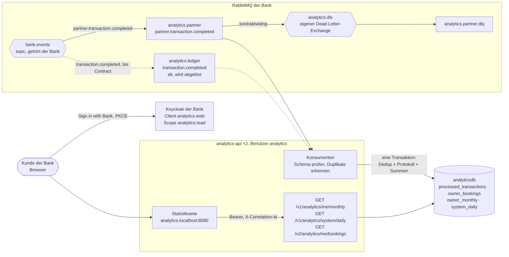

# analytics-api

Der Dienst der **Analytics-Firma** im Modul M321. Ein externer Partner der Bank: er bekommt die
Buchungen der Bank als Ereignisse über ihren Broker, rechnet daraus Summen und zeigt sie den
Kunden der Bank, die ihm das bei "Sign in with Bank" erlaubt haben. Code und Datenbank der Bank
sieht er nicht. Kontrakte und Deployment des Gesamtsystems liegen im Shared-Repo
`Tim-Fischer-zh/m321-main`.



| Fall | Was passiert |
|---|---|
| Buchung kommt doppelt, auch über beide Queues oder auf beiden Instanzen gleichzeitig | zählt einmal: `transactionId` ist Primärschlüssel in `processed_transactions`, in derselben Transaktion wie die Summen |
| Nachricht passt nicht zum Kontrakt | ohne Wiederholung in die Dead-Letter-Queue |
| eigene Datenbank weg | Nachricht nach 2 s zurück in die Queue, nie in die DLQ; API antwortet 503 mit `Retry-After` |
| Broker weg | alle 2 s neuer Versuch; die Bank publiziert über ihre Outbox weiter, nichts geht verloren |
| kein oder ungültiges Token | 401 |
| Token ohne Scope `analytics:read` | 403 mit `WWW-Authenticate: Bearer error="insufficient_scope", scope="analytics:read"` |
| `system/daily` ohne Rolle `bank-admin` | 403 |
| fremde Summen oder Buchungen | gibt es nicht: der Inhaber kommt aus `sub` im Token, nie aus der Anfrage |
| Buchungsprotokoll ohne Zeitraum | die letzten 30 Tage; `from` nach `to` oder mehr als 366 Tage ergibt 400 |

## Starten

```bash
docker compose up --build -d                              # Dienst, Postgres, RabbitMQ
docker compose --profile observability up --build -d      # dazu Loki, Alloy, Tempo, Prometheus, Grafana
docker compose up -d --scale analytics-api=3              # Competing Consumers
```

Das Profil `observability` braucht `m321-main` neben diesem Repository. Das Gesamtsystem mit den
Diensten der Bank startet aus `m321-main`, mit einem lokal gebauten Image so:

```bash
docker build -f src/Analytics.Api/Dockerfile -t ghcr.io/leart165/analytics-api:local .
cd ../m321-main && ANALYTICS_TAG=local docker compose --profile observability up -d
```

| Adresse im Gesamtsystem | Was |
|---|---|
| http://analytics.localhost:8080/ | Statistikseite, "Sign in with Bank" |
| http://localhost:8080/v1/analytics/... | API über Traefik |
| http://localhost:8080/analytics/swagger/index.html | Spezifikation mit Scopes |
| http://localhost:8080/analytics/health | Bereitschaft mit Datenbankprüfung |
| http://127.0.0.1:15672 | RabbitMQ, der Dienst als Benutzer `analytics` |
| http://127.0.0.1:3000 | Grafana: Loki, Tempo, Prometheus |

## Tests

```bash
docker compose up -d analyticsdb rabbitmq
dotnet test
node --test "tests/frontend/*.test.mjs"
```

Mehr in [docs/architecture.md](docs/architecture.md), die Vorführung in [docs/demo.md](docs/demo.md),
Bildschirmfotos aus dem Gesamtsystem in [docs/nachweis](docs/nachweis).
