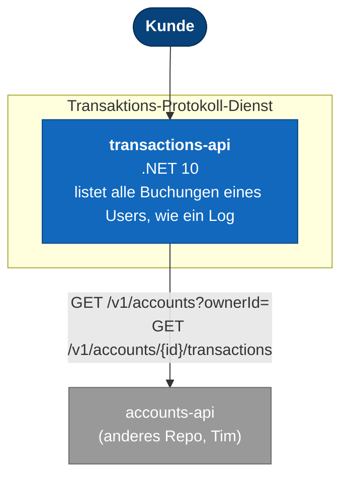

# Architektur

Transaktions-Protokoll-Dienst der Bank-App für Modul M321. Kontendienst und Auszugsdienst
liegen im Repository meines Teamkollegen Tim (`m321`); die Konten- und Transaktionsdaten selbst
speichert dieser Dienst nicht, er fragt sie live beim Kontendienst ab. Der Vertrag, an den sich
beide Seiten halten, steht in dessen `contracts/accounts/openapi.v1.yaml`.

## Was hier läuft



Kein eigener Zustand, keine Datenbank: dieser Dienst ist ein reiner Abfrage-/Aggregations-Dienst
vor dem Kontendienst.

## Starten

```bash
docker compose up --build -d
```

| Adresse | Was |
|---|---|
| http://localhost:8082/swagger | Alle Endpunkte ausprobieren |
| http://localhost:8082/v1/transactions?ownerId=... | Transaktions-Log eines Users |
| http://localhost:8082/health | Bereitschaft |

`AccountsApi__BaseUrl` (Umgebungsvariable bzw. `AccountsApi:BaseUrl` in `appsettings.json`)
zeigt auf den Kontendienst. In `docker-compose.yml` ist das der Compose-Service-Name
`accounts-api`; lokal ohne Compose `http://localhost:8080` (siehe `appsettings.Development.json`).

## Aufbau des Codes

```
src/
  Auth.Domain/          Transaction, TransactionKind, Fehlerarten
  Auth.Application/      TransactionLogService: Konten und deren Buchungen holen, zusammenführen, sortieren
  Auth.Infrastructure/    AccountsApiClient: HTTP-Client für den Kontendienst
  Auth.Api/               Controller und DTOs               → Container
```

Projekt- und Namespace-Namen (`Auth.*`) sind aus der Vorgängerversion des Dienstes
(Registrierung/Login/JWT) übernommen und nicht umbenannt worden, um den Diff klein zu halten.

Die Abhängigkeiten zeigen nur nach innen. `Auth.Domain` referenziert nichts und weiss nichts von
HTTP oder JSON.

## Fachlichkeit

`GET /v1/transactions?ownerId=...` liefert alle Buchungen, die ein Benutzer über all seine Konten
hinweg durchgeführt hat, absteigend nach Buchungsdatum sortiert — ein Log. Der Dienst holt dazu
erst die Konten des Inhabers (`GET /v1/accounts?ownerId=`), danach parallel je Konto dessen
Buchungen, und führt beides zusammen. Eine leere Liste (Benutzer ohne Konten oder Buchungen) ist
kein Fehler.

## Offener Punkt: fehlender Vertrag beim Kontendienst

`contracts/accounts/openapi.v1.yaml` (Stand beim Schreiben dieses Dienstes) definiert **keinen**
Endpunkt, der die Buchungen eines einzelnen Kontos auflistet — nur `POST .../deposits` und
`POST .../withdrawals`, die je eine einzelne neu gebuchte `Transaction` zurückgeben. Dieser
Dienst nimmt an, dass es `GET /v1/accounts/{accountId}/transactions` (Antwort: `Transaction[]`,
gleiches Schema wie in der bestehenden Spec) gibt oder geben wird. Solange der Kontendienst
diesen Endpunkt nicht anbietet, antwortet `GET /v1/transactions` mit `502 Bad Gateway`. Diese
Erweiterung muss mit Tim abgestimmt und in `contracts/accounts/openapi.v1.yaml` ergänzt werden.

## Was absichtlich fehlt

Keine Authentifizierung: wie `accounts-api` in Version 1 kommt `ownerId` aus der Anfrage, nicht
aus einem Token. Kein Caching, kein Circuit Breaker, keine Wiederholungsversuche gegen den
Kontendienst — bei jedem Ausfall antwortet dieser Dienst sofort mit 502.
