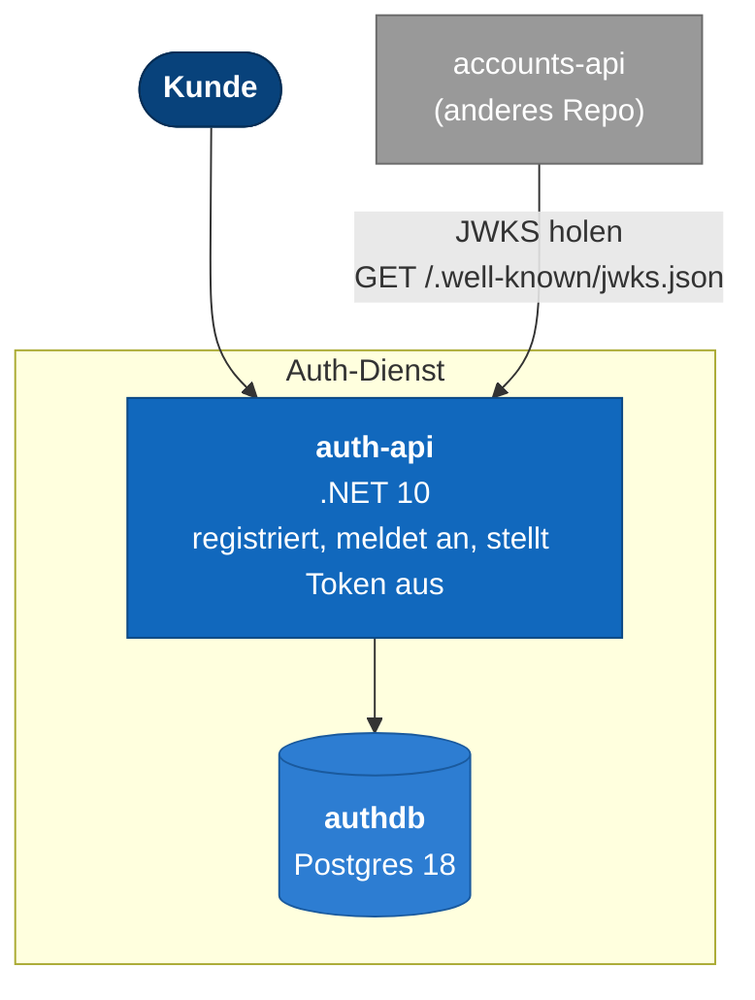

# Architektur

Der Auth-Service der Bank-App für Modul M321. Kontendienst und Auszugsdienst liegen im
Repository meines Teamkollegen Tim (`m321`). Die Schnittstellenkontrakte, an die sich beide
Seiten halten, stehen in `contracts/auth/` dieses Kontrakts: `openapi.v1.yaml` und `jwt.md`.

## Was hier läuft



Ein einzelner Prozess und eine Datenbank. Kein Broker: dieser Dienst veröffentlicht (noch)
kein `user.registered`-Ereignis, er beantwortet ausschliesslich HTTP-Anfragen.

## Starten

```bash
docker compose up --build -d
```

| Adresse | Was |
|---|---|
| http://localhost:8082/swagger | Alle Endpunkte ausprobieren |
| http://localhost:8082/.well-known/jwks.json | Öffentliche Schlüssel |
| http://localhost:8082/health | Bereitschaft |
| localhost:5434 | authdb, auth / auth |

## Aufbau des Codes

```
src/
  Auth.Domain/          Benutzer, E-Mail-Adresse, Fachregeln
  Auth.Application/      AuthService: registrieren, anmelden, abfragen
  Auth.Infrastructure/    Datenbank, Passwort-Hashing, RSA-Schlüssel, JWT-Ausstellung
  Auth.Api/               Controller und DTOs               → Container
contracts/                Kopie der vereinbarten Schnittstelle
```

Die Abhängigkeiten zeigen nur nach innen. `Auth.Domain` referenziert nichts. Die Domäne weiss
nichts von Passwort-Hashing, RSA oder JWT: sie hält einen bereits gehashten Wert, ausgestellt
von einer Schnittstelle, die die Infrastruktur umsetzt.

## Fachlichkeit

Ein Benutzer hat eine E-Mail-Adresse (eindeutig, klein geschrieben) und einen Anzeigenamen.
Registrierung und Anmeldung sind die beiden Vorgänge; alles andere ist Abfrage.

`POST /v1/auth/register` prüft, ob die Adresse schon vergeben ist, hasht das Passwort
(PBKDF2-HMAC-SHA256, 210'000 Iterationen, zufälliges Salt je Benutzer) und legt den Benutzer
an. `POST /v1/auth/login` prüft die Zugangsdaten und stellt bei Erfolg ein Token aus. Beide
Fälle einer falschen Anmeldung — unbekannte Adresse oder falsches Passwort — ergeben dieselbe
Antwort, damit sich nicht erraten lässt, welche Adressen registriert sind.

## Token

Aufbau und Pflicht-Claims stehen abschliessend in `contracts/auth/jwt.md`. Kurz zusammengefasst:
RS256, `sub` ist die Benutzer-Id (== `ownerId` beim Kontendienst), `aud` ist `bank-api`.

Das RSA-Schlüsselpaar entsteht beim allerersten Start und wird auf der Festplatte abgelegt
(`Jwt:SigningKeyPath`, im Container ein eigenes Volume). Jeder weitere Start lädt denselben
Schlüssel, damit bereits ausgestellte Token nicht mit jedem Neustart ungültig werden. Andere
Dienste prüfen Token ausschliesslich über den öffentlichen Teil, den sie unter
`GET /.well-known/jwks.json` abrufen — der private Schlüssel verlässt diesen Prozess nie.

## Datenbank

Eine Tabelle, `users`. Das Schema entsteht ausschliesslich aus EF-Core-Migrationen, die beim
Start angewendet werden. Der eindeutige Index auf `email` ist die letzte Instanz gegen zwei
gleichzeitige Registrierungen mit derselben Adresse; die Anwendungsschicht prüft vorab, damit
der übliche Fall eine verständliche Antwort bekommt.

## Was absichtlich fehlt

Dieser Dienst veröffentlicht kein `user.registered` auf `bank.events`. Der Kontendienst kann
deshalb (noch) kein automatisches Standardkonto eröffnen. Sobald das dazukommt, folgt es
demselben Outbox-Muster wie im Kontendienst: Benutzer und Ereignis in derselben Transaktion,
ein Hintergrunddienst gibt es an den Broker.
