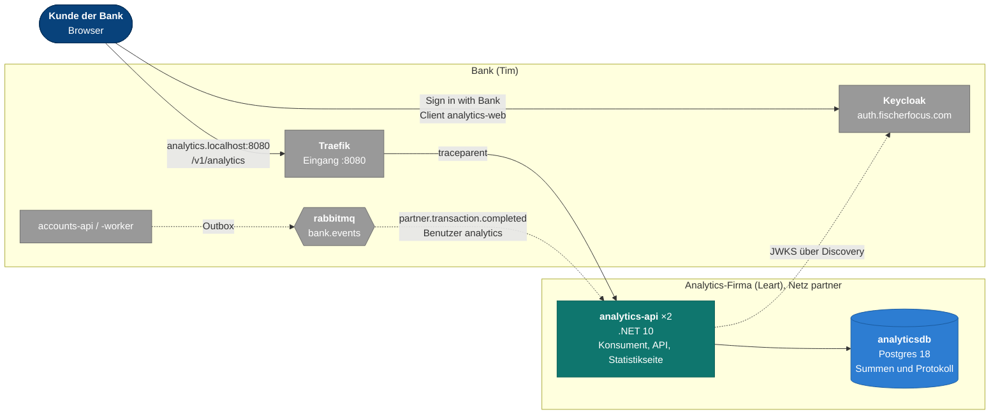
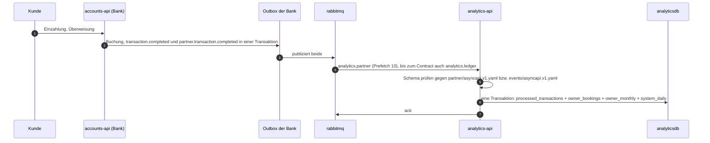
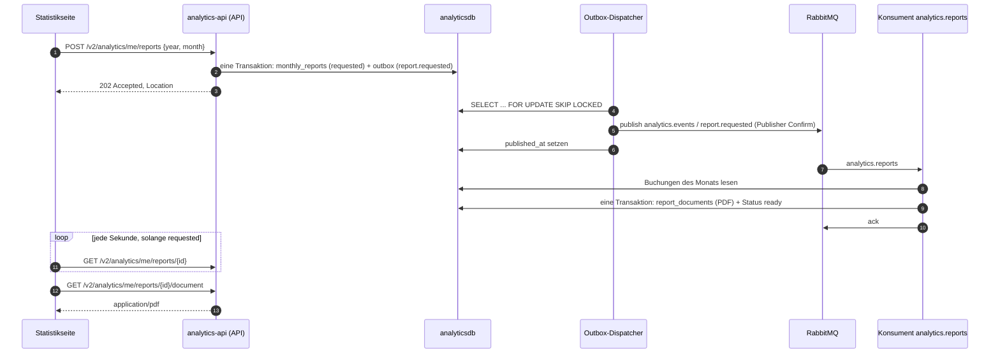
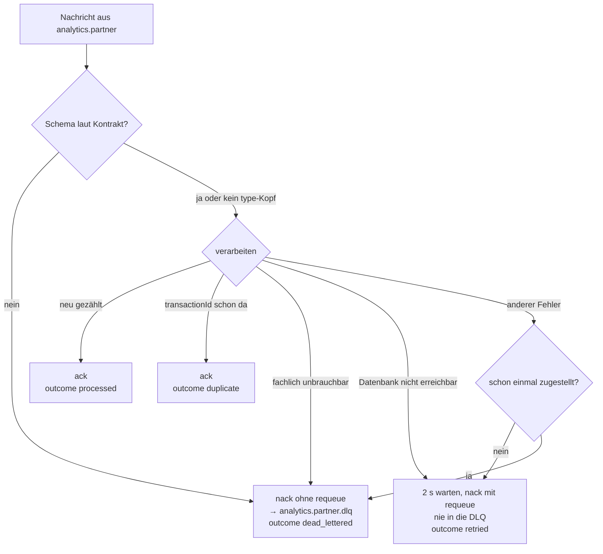

# Architektur

Ich baue in diesem Repository den Auswertungsdienst für das Modul M321. In unserem Team ist Tim
die Bank; ich spiele eine **externe Analytics-Firma**, die für die Bank Statistiken rechnet. Ich
sehe weder Code noch Datenbank der Bank, sondern nur, was sie über veröffentlichte Kontrakte
anbietet: Buchungsereignisse über ihren Broker, einen eigenen Broker-Benutzer, und Tokens aus
ihrem Keycloak (`auth.fischerfocus.com`, Realm `personal`) für ihre Kunden, die mich bei
"Sign in with Bank" zugelassen haben.

Kontrakte und Deployment des Gesamtsystems liegen im Shared-Repo `Tim-Fischer-zh/m321-main`.
Dieses Dokument beschreibt, was heute in diesem Repository steht.

## Überblick



Durchgezogen ist synchron (HTTP), gestrichelt asynchron (AMQP). Mein Container hängt nur im Netz
`partner`: er sieht `analyticsdb`, `rabbitmq`, `alloy` und `traefik`, aber keine Datenbank der
Bank.

| Richtung | Protokoll | Kontrakt | Zweck |
|---|---|---|---|
| Bank → Analytics | AMQP, `bank.events` / `partner.transaction.completed` | `partner/asyncapi.v1.yaml`, `analytics/asyncapi.v2.yaml` | jede Buchung, ohne Konto und Buchungstext |
| Bank → Analytics (bis Contract) | AMQP, `bank.events` / `transaction.completed` | `events/asyncapi.v1.yaml`, `analytics/asyncapi.v1.yaml` | die alte, interne Buchung |
| Kunde → Analytics | HTTP über Traefik | `analytics/openapi.v1.yaml`, `auth/scopes.md` | Summen lesen |
| Analytics → Keycloak | HTTPS, Discovery und JWKS | `auth/jwt.md` | Token prüfen |

## Aufbau des Codes (DDD, Schichten nach innen)

```
src/
  Analytics.Domain/          Buchung, Währung, Beitrag zu den Summen; Monatsbericht (Aggregat mit
                             Zustand), Berichtszeitraum, Inhalt des Berichts (MonthlyStatement)
  Analytics.Application/     LedgerProjection (Summen führen), ReportService (beantragen, erzeugen),
                             Ports ITotalsStore, I*Reader, IMonthlyReportRepository, IReportEvents,
                             IStatementRenderer, IUnitOfWork
  Analytics.Infrastructure/  Postgres (EF Core), Outbox und Dispatcher, RabbitMQ (Topologie,
                             Konsumenten, Schema-Prüfung), PDF ohne fremde Bibliothek, OpenTelemetry
  Analytics.Api/             Controller, DTOs, Keycloak-Prüfung mit Scopes, Readiness, Swagger,
                             Statistikseite unter wwwroot                            → Container
tests/Analytics.Tests/       Domäne, Persistenz, Nachrichten, Broker, API, Kontrakte, Observability
tests/frontend/              JavaScript der Statistikseite
contracts/                   Kopie aus m321-main, von der CI verglichen
```

Die Abhängigkeiten zeigen nur nach innen. `Analytics.Domain` kennt nichts, nicht einmal JSON. Es
gibt keinen geteilten Code mit der Bank: Messaging, Tracing, Scopes und Readiness folgen denselben
Regeln wie bei Tim, sind hier aber eigenständig umgesetzt.

## Asynchron: eine Buchung wird gezählt



Gespeichert werden Summen je Inhaber und Monat (`owner_monthly`), für die ganze Bank je Tag
(`system_daily`) und seit Version 2 jede Buchung des Inhabers (`owner_bookings`), damit der
Kunde unter „Buchungen“ jede einzelne sieht (`GET /v2/analytics/me/bookings`). Im Protokoll
steht nur, was das Partner-Ereignis enthält: Art, Betrag, Währung, Zeitpunkt und
`transactionId`; Buchungstext, Konto und Gegenpartei bekommt die Analytics-Firma nicht. Das
Protokoll beginnt mit Version 2; ältere Buchungen kennt der Dienst nur als Summe.

**Idempotenz.** RabbitMQ stellt mindestens einmal zu. `processed_transactions` hat die
`transactionId` als Primärschlüssel; der Eintrag, das Protokoll und beide Summen gehen in *einer*
Datenbanktransaktion hinaus (`INSERT ... ON CONFLICT DO NOTHING`, danach Upserts). Dieselbe
Buchung zählt deshalb einmal, auch wenn sie über beide Queues kommt oder zwei Instanzen sie
gleichzeitig bekommen: die Eindeutigkeit sichert die Datenbank, nicht der Speicher eines Prozesses.

**Entkopplung.** Fällt dieser Dienst aus, merkt die Bank nichts: sie publiziert über ihre Outbox
weiter, die Nachrichten warten in `analytics.partner`, und nach dem Start wird alles nachgeholt.
Queues mit `analytics.` hat die Bank auf 100 MB begrenzt; darüber verwirft der Broker die ältesten
Nachrichten, damit ein langsamer Partner die Bank nie bremst.

## Asynchron: ein Monatsbericht als PDF

Gebaut wie die Überweisung der Bank: annehmen, sofort antworten, im Hintergrund erledigen. Die
Nachricht geht über einen **eigenen Topic-Exchange** `analytics.events`, so wie die Bank ihre
Ereignisse über `bank.events` schickt. Kontrakt: `contracts/analytics/events.asyncapi.v1.yaml`.



| Baustein | Wo | Warum |
|---|---|---|
| Aggregat `MonthlyReport`, Zustände `Requested → Ready \| Failed` | Domain | Ein abgeschlossener Bericht ändert sich nie wieder, wie der Überweisungsauftrag der Bank |
| `MonthlyStatement` | Domain | Was im Bericht steht (Reihenfolge, Summen je Währung), unabhängig vom PDF |
| `ReportService` | Application | `RequestAsync` in der API, `GenerateAsync` im Konsumenten |
| Outbox | Infrastructure | Antrag und Ereignis werden zusammen gültig; steht der Broker, geht nichts verloren |
| `xmin` als Concurrency-Token | Infrastructure | Bekommen zwei Instanzen denselben Antrag, gewinnt die erste, die zweite bestätigt nur |
| PDF aus Standardschriften, schwarz-weiss | Infrastructure | Keine Schriftdateien und keine native Bibliothek im alpine-Image |

Der Broker-Benutzer `analytics` darf alles mit dem Präfix `analytics.` anlegen und beschreiben;
für den eigenen Exchange muss die Bank nichts ändern. Auf `bank.events` schreiben darf er nicht.

## Fehlerbehandlung beim Konsumieren



Der Dead-Letter-Exchange ist `analytics.dlx` (direct), der Routing Key ist der Name der Queue.
Ist der Broker beim Start nicht da oder scheitert die Vorbereitung, wird der Kanal geschlossen
und alle zwei Sekunden neu versucht; es bleiben keine Kanäle liegen (getestet, der Broker erlaubt
dem Benutzer `analytics` höchstens 50).

## Broker-Benutzer und Umstellung auf das Partner-Ereignis

Die Bank gibt mir den Benutzer `analytics` (`rabbitmq/partner-access.sh` in `m321-main`):
configure und write nur auf `analytics.*`, read auf `analytics.*` und `bank.events`, binden an
`bank.events` nur für bestimmte Routing Keys. Deshalb deklariert der Dienst `bank.events` nur
passiv und hat einen eigenen Dead-Letter-Exchange `analytics.dlx`; beides verweigert der Broker
sonst mit `ACCESS_REFUSED` (getestet).

Die alte Queue `analytics.ledger` hatte `bank.dlx` als Dead-Letter-Exchange, und Queue-Argumente
lassen sich nicht ändern. Die Umstellung ist deshalb eine neue Queue, als **Expand and Contract**,
gesteuert über `RabbitMq:LegacyQueue`:

| Schritt | Wer | Was |
|---|---|---|
| Expand | Leart | `analytics.partner` an `partner.transaction.completed`; `analytics.ledger` wird nur passiv geprüft und weiter geleert (`LegacyQueue=Drain`). Jede Buchung kommt zweimal und zählt einmal |
| Benutzer | Leart, PR an m321-main | `RabbitMq__User: analytics` |
| Contract | Leart | `LegacyQueue=Retire`: Bindung an `transaction.completed` lösen, Rest lesen, `analytics.ledger` löschen, sobald leer; ihre DLQ ebenso, sobald leer |
| Abschluss | Tim | `ANALYTICS_EVENTS=partner-only`, `guest` abschalten |

Partner-Ereignisse tragen keinen `traceparent` und je Ereignis eine neue `correlation-id`. Ihre
Verarbeitung beginnt deshalb einen eigenen Trace mit der `correlation-id` als
`messaging.message.conversation_id`; nur die alte Queue setzt noch den Trace der Bank fort.

## Security: Scope, Rolle, Besitz

Ein Zugriff braucht drei Dinge (`contracts/auth/scopes.md`):

| Frage | Hier |
|---|---|
| Was darf der **Client** im Namen des Kunden? | Scope `analytics:read` im Claim `scope`, Policy an beiden Endpunkten. Fehlt er: 403 mit `WWW-Authenticate: Bearer error="insufficient_scope", scope="analytics:read"` |
| Was darf der **Benutzer**? | `system/daily` zusätzlich Realm-Rolle `bank-admin` aus `realm_access`. Fehlt sie: 403 ohne `insufficient_scope`, mehr Zustimmung hilft nicht |
| **Welche** Daten? | `me/monthly` liest den Inhaber aus `sub`, nie aus der Anfrage |

Dazu die Prüfung des Tokens selbst: ES256 fest, `iss`, `aud` = `m321-analytics-api`, Ablauf,
`typ` = `Bearer`, `sub`, `iat`. Die Spezifikation beschreibt das als OAuth2-Schema `keycloak`
(Authorization Code) und nennt an jeder Operation ihren Scope; ein Vertragstest vergleicht das mit
`scopes.md`.

## Statistikseite, "Sign in with Bank"

HTML, CSS und JavaScript-Module ohne Framework unter `src/Analytics.Api/wwwroot`, ausgeliefert
vom Dienst selbst. Im Gesamtsystem unter **`http://analytics.localhost:8080/`**, über eine
Host-Regel in Traefik: eine eigene Origin, damit ein Skript dieser Seite nie an die Tokens des
Frontends der Bank unter `localhost:8080` kommt.

Anmeldung mit PKCE am Client `analytics-web`, Scope `analytics:read`. Beim ersten Mal fragt die
Bank den Kunden um Zustimmung; entziehen kann er sie in der App der Bank unter "Verbundene
Dienste". Die Seite zeigt die Monatssummen, für `bank-admin` die Tagessummen der Bank, welche
Freigabe der Kunde erteilt hat, und bei fehlendem Scope einen Knopf für die neue Zustimmung. Eine
Content-Security-Policy erlaubt nur eigene Skripte und Verbindungen zur API und zum Keycloak.

Im Keycloak braucht `analytics-web` dafür `http://analytics.localhost:8080/*` als Redirect-URI
und `http://analytics.localhost:8080` als Web Origin; das trägt Tim ein.

## Observability

| Was | Umsetzung |
|---|---|
| Logs | JSON auf stdout mit Scopes und UTC; Alloy liest sie aus Docker nach Loki. Jede Zeile einer Anfrage trägt `CorrelationId`, jede Zeile einer Nachricht zusätzlich `MessageId` und `Queue`, mit Tracing `TraceId` und `SpanId` |
| Traces | OpenTelemetry über OTLP an Alloy, weiter an Tempo, Dienstname `analytics-api`, Instanz = Hostname. HTTP setzt den Trace von Traefik fort (nur `/v1`); Npgsql-Spannen nur innerhalb eines Traces; Partner-Ereignisse beginnen einen eigenen |
| Metriken | HTTP, .NET-Laufzeit und `bank_messages_consumed_total{queue, outcome}` mit `processed`, `duplicate`, `retried`, `dead_lettered`, wie bei den Konsumenten der Bank |
| Schalter | nur wenn `OTEL_EXPORTER_OTLP_ENDPOINT` gesetzt ist; Tests laufen ohne |

## Skalierung, Readiness, Herunterfahren

Zustandslos, alles liegt in Postgres. Zwei Instanzen konsumieren dieselben Queues als Competing
Consumers (Prefetch 10). Die Migration beim Start läuft unter einem Advisory Lock.

Das Image lauscht auf 8080 (API) und 8081 (`/ready`, nur intern). Der Healthcheck im Dockerfile
fragt `/ready`; Traefik routet nur an gesunde Container. Bei SIGTERM meldet die Instanz sofort
"nicht bereit", bedient noch 8 s, meldet dann ihre Konsumenten beim Broker ab (`BasicCancel`),
verarbeitet laufende Nachrichten zu Ende und schliesst erst dann die Kanäle. `/ready` prüft
bewusst weder Datenbank noch Broker; das tut `/health`, das bei Datenbankausfall 503 meldet.
Die API antwortet dann ebenfalls 503 mit `Retry-After: 2` statt 500. Timeouts zur Datenbank stehen
im Connection-String (`Timeout=3;Command Timeout=10`).

## Deployment

| Umgebung | Compose-Datei | Images | Start |
|---|---|---|---|
| Entwicklung | `docker-compose.yml` hier | aus dem Quellcode | `docker compose up --build -d` |
| mit Observability | dieselbe, Profil `observability`, `m321-main` daneben | aus dem Quellcode | `docker compose --profile observability up --build -d` |
| Gesamtsystem | `docker-compose.yml` in `m321-main` | GHCR oder lokal getaggt | `ANALYTICS_TAG=local docker compose --profile observability up -d` |

Im Gesamtsystem ist Traefik der einzige Eingang (Port 8080, Ratenlimit 300/s, Stösse 600):
`/v1/analytics/...` geht unverändert an den Dienst, `/analytics/swagger/...` und
`/analytics/health` mit abgeschnittenem Präfix, `analytics.localhost` vollständig. Die
Swagger-Oberfläche lädt ihre Spezifikation deshalb relativ.

## Tests und CI

109 Tests in .NET und 18 in JavaScript. Persistenz, Nachrichtenverarbeitung und API laufen gegen
echtes Postgres, die Broker-Tests gegen echtes RabbitMQ in einem eigenen virtuellen Host mit genau
den Rechten des Benutzers `analytics`. Die CI (`.github/workflows/publish.yaml`): Formatprüfung,
JavaScript, Abgleich der Kontrakte mit `m321-main`, Build mit `-warnaserror`, Tests mit Postgres
und RabbitMQ, auf `main` das Image für amd64 und arm64.

## Veränderungsverzeichnis

| Datum | Änderung | Grund |
|---|---|---|
| 2026-09-25 | Auth-Dienst entfernt, Auswertungsdienst mit Konsument und zwei Endpunkten | Login übernimmt der Keycloak der Bank |
| 2026-09-27 | JSON-Logs, OpenTelemetry, Schema-Prüfung zur Laufzeit, Retry mit Wartezeit, Statistikseite | Observability wie bei der Bank |
| 2026-09-28 | Swagger relativ hinter dem Präfix von Traefik | Oberfläche unter `/analytics/swagger` |
| 2026-09-28 | Partner-Ereignis, Queue `analytics.partner`, `analytics.dlx`, nur passiv an `bank.events`, Umstellung Drain/Retire, Kontrakt `analytics/asyncapi.v2.yaml` | eigener Broker-Benutzer der Bank, Datenschutz: kein Buchungstext, kein Konto |
| 2026-09-28 | Scope `analytics:read`, OAuth2 in der Spezifikation, Statistikseite als "Sign in with Bank" auf `analytics.localhost` | Scopes der Bank, eigene Origin |
| 2026-09-28 | 503 bei Datenbankausfall, 400 ohne `from`/`to`, 401/403 ohne Körper, keine liegen gebliebenen Kanäle | Review vom 25. September |
| 2026-09-28 | `/ready`, Healthcheck, Abfliessen und `BasicCancel` beim Stoppen, zwei Replikas | Skalierung und Deployment ohne Lücke |
| 2026-09-28 | Übersicht mit Saldo vom Kontendienst entfernt | Die Bank gibt dem Partner keinen Zugang zu Konten (`scopes.md`) |
| 2026-09-28 | Buchungsprotokoll `GET /v2/analytics/me/bookings`, Tabelle `owner_bookings`, Reiter "Buchungen" | Kunden wollen jede einzelne Buchung sehen, nicht nur Summen |
| 2026-10-02 | Monatsbericht als PDF: `POST /v2/analytics/me/reports` mit 202, Outbox, eigener Exchange `analytics.events`, Queue `analytics.reports`; Statistikseite in Graustufen | Beantragen wie die Überweisung der Bank; Seite ohne Farbe gewünscht |
